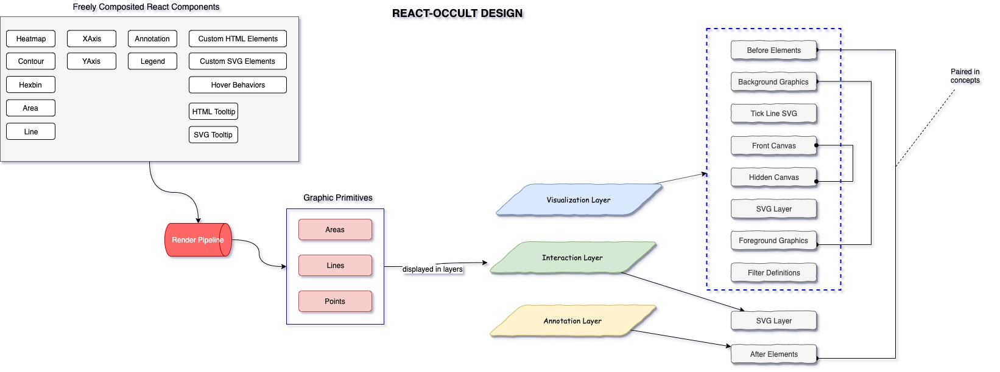
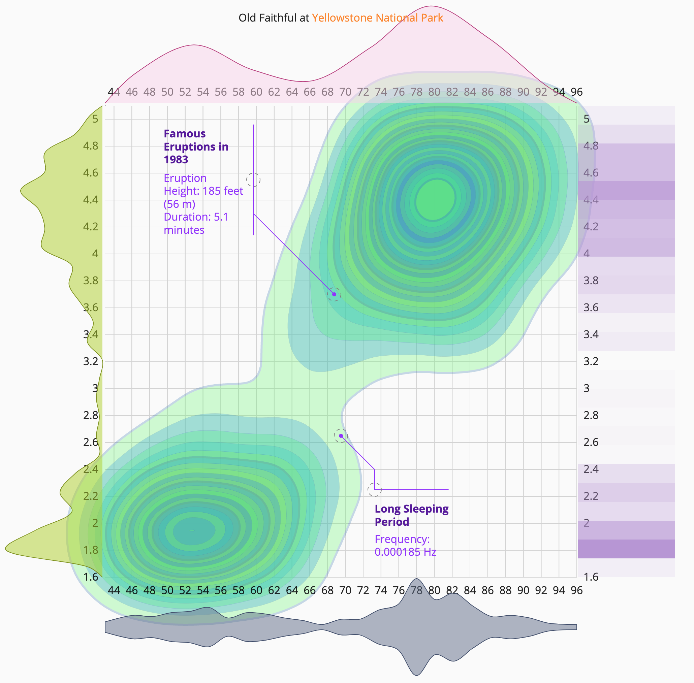
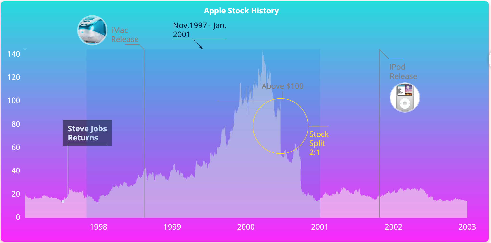
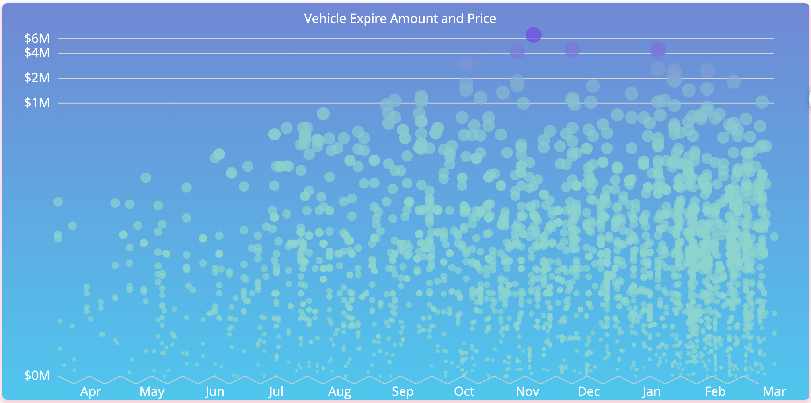
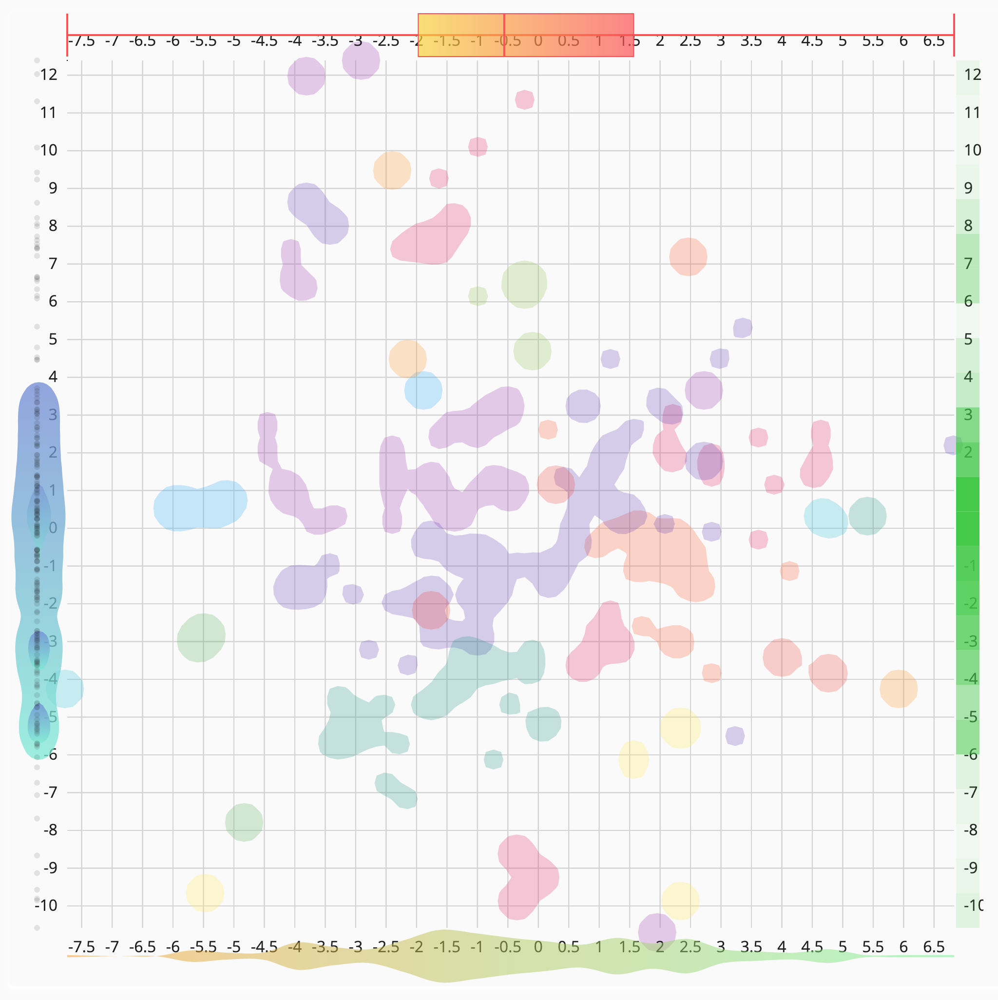
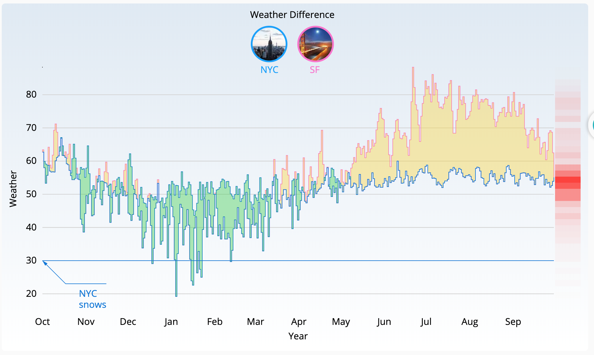
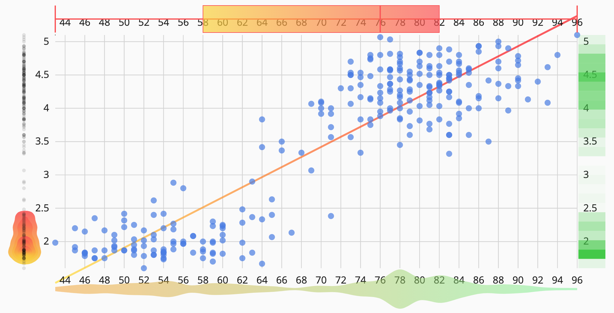

# React Occult: EXPERIMENTAL, NOT PRODUCTION READY
## Design 


## Demo
Contour with Violin/Heatmap, Axes

Stock chart with annotations

Scatter Plot

NYC Hospital

Neighbourhood

Difference Chart

Trendline



Full source code is at: [Old Faithful Contour](https://github.com/BigFatDog/react-occult/blob/e0967a2ff9906159873024b2daf0bfb4dd0c3360/docs/app/containers/Pages/OldFaithfulPage/index.js#L77)

## Quick Guide to API

```javascript 1.6
    <XYFrame {...frameProps}>
      <XAxis label={'Rank'} />
      <YAxis left={50} label={'Theaters'} />
      <Annotation type={'y'} label={'a vertical divide line'} y={100} />
      <Annotation
        type={AnnotationCalloutCircle}
        note={{ label: 'callout', title: 'an annotation' }}
        score={10}
        subject={{ radius: 10 }}
        x={100}
        y={100}
      />
      <Line {...lineProps} />
      <Heatmap {...heatmapProps} />
      <Contour {...contourProps} />
      <Legend {...legnedProps} />
      <Gradient />
    </XYFrame>
```
## Design Brief
* Components are freely composed within a `Frame`. Each component may have its dedicated data.
* All charts are translated into a render pipeline which contains ***only graphic primitives: areas, points and lines***.
* Render Pipeline are visualized in layers, in format of canvas render queue or SVG/HTML elements.

Other thoughts:
* when render pipeline is rendered in canvas, when can improve performance with ``reqAnimationFrame``. This is beyond the scope of `react` rendering
* when render pipeline is rendered in SVG/HTML, it is under ``react``'s control

## Try in dev
1. Download/Clone code
2. Run commands
```
npm install         // install dependencies
npm run dev         // view demos in web browser at localhost:8080
```
## Try in product
run command: ``npm install react-occult --save``

## Demo code
code is at: [demo usage](https://github.com/BigFatDog/react-occult/tree/master/docs/app/containers/Pages)

## Credits
Heavily inspired by [semiotic](https://semiotic.nteract.io/guides/annotations)

## License

This project is licensed under the MIT License - see the [LICENSE](LICENSE) file for details
